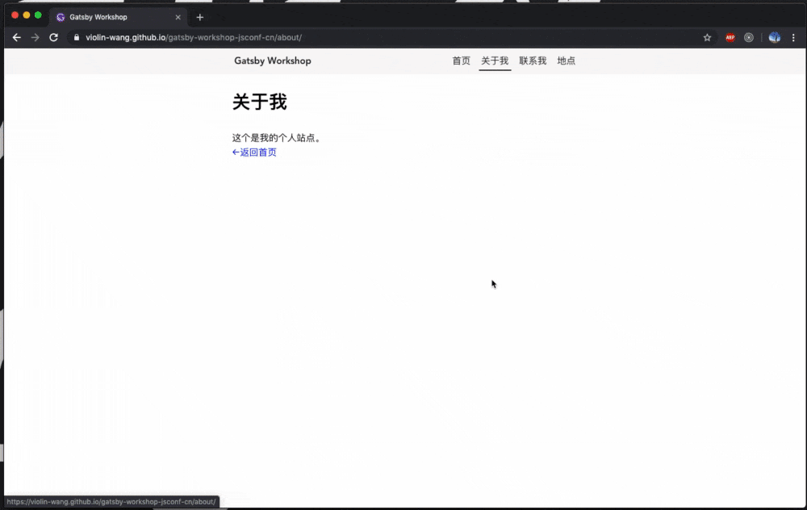
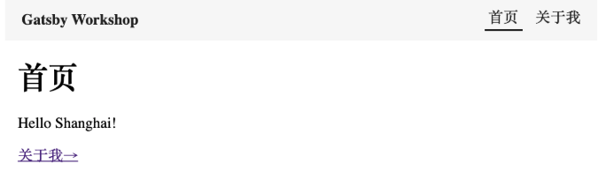
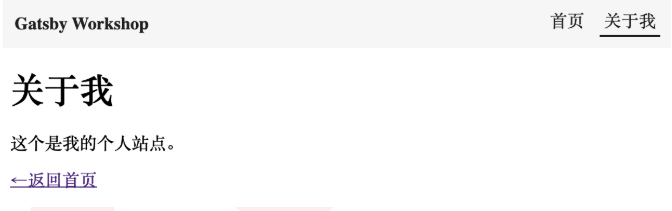
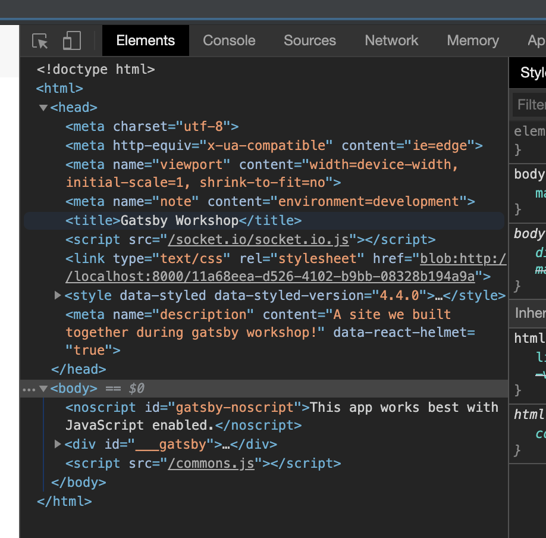
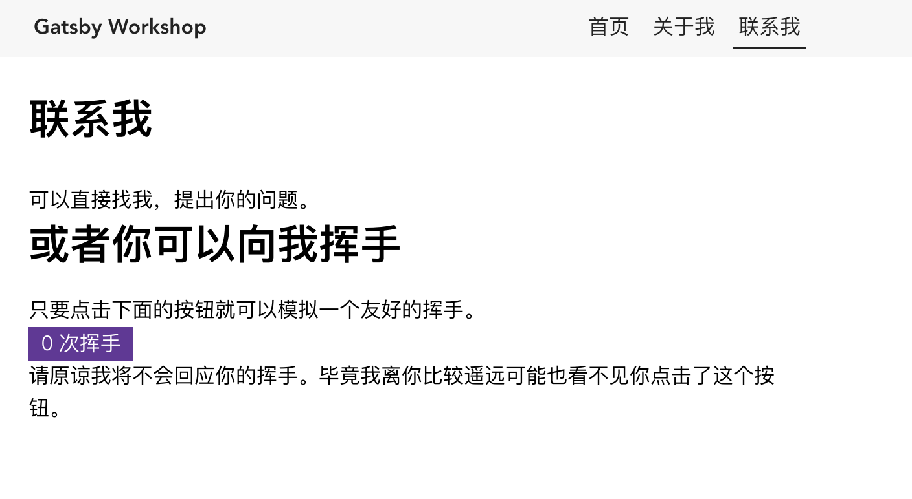
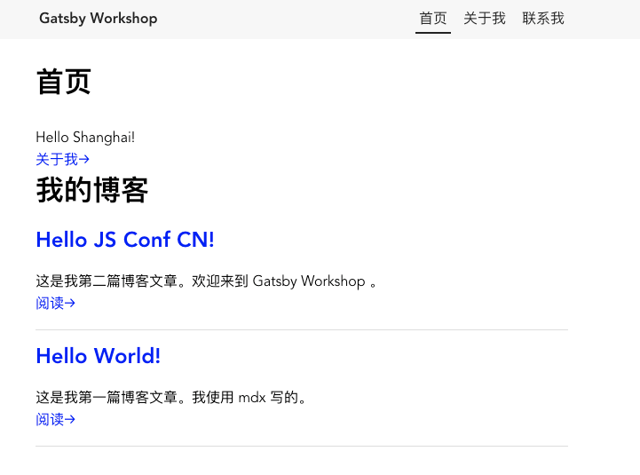
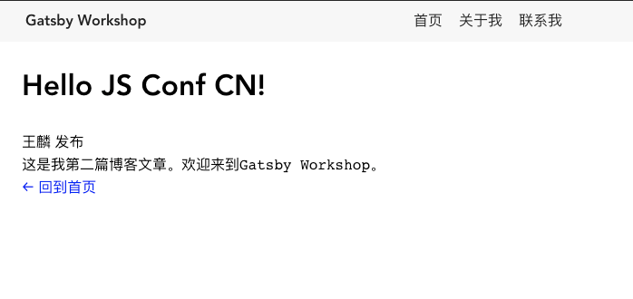
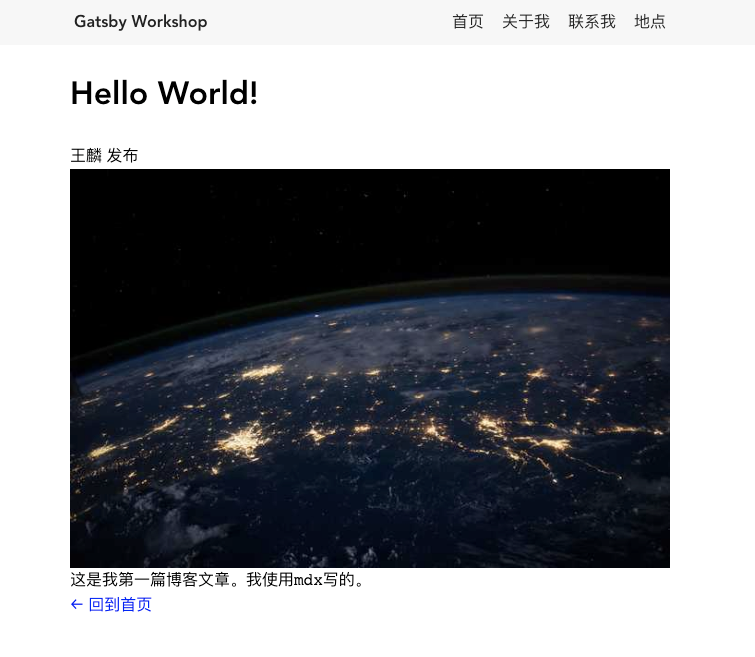
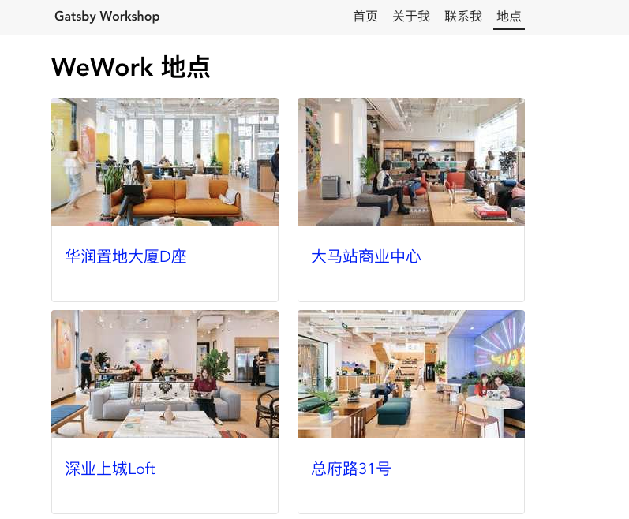
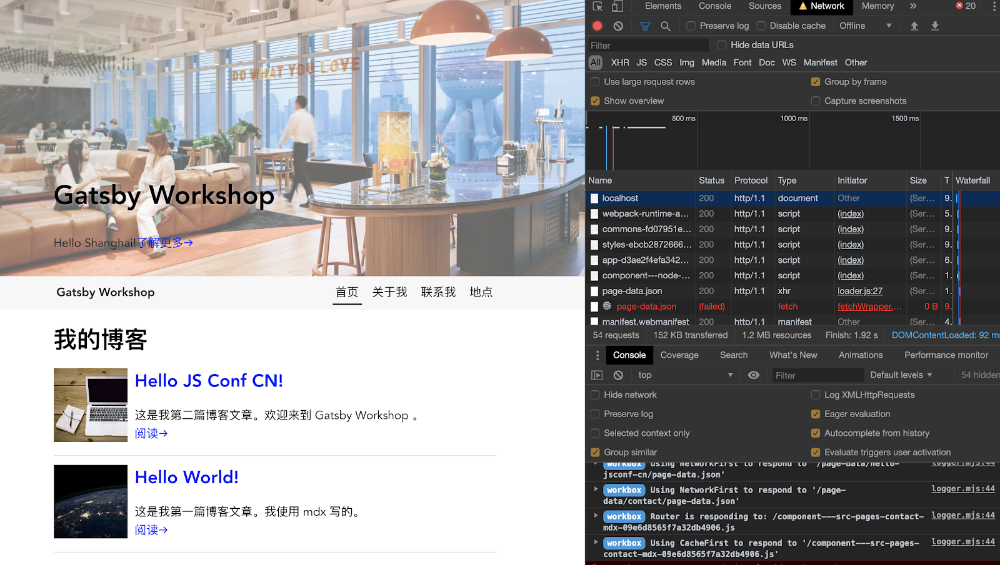

# Gatsby Workshop JSConf CN

## 依赖环境

- [ ] Node.js
- [ ] npm
- [ ] git
- [ ] gatsby-cli

### 安装gatsby-cli

```shell
npm install -g gatsby-cli  --registry=https://registry.npm.taobao.org
```


## 项目初始化

```shell
SHARP_DIST_BASE_URL=https://npm.taobao.org/mirrors/sharp-libvips/v8.8.1/ gatsby new gatsby-workshop-jsconf-cn https://github.com/violin-wang/gatsby-workshop-jsconf-cn-starter
```

## 最终效果



## 步骤实现

### 步骤1-页面和布局

#### 初始化

```shell
git checkout step1-start
```
#### Todo

- [ ] 添加页面
- [ ] 添加布局组件
- [ ] 站点SEO信息
- [ ] 添加contact页面

#### 最终效果

- 首页


- 关于我页面


- 站点SEO信息


- 联系我页面




### 步骤2-博客文章

#### 初始化

```shell
git checkout step2-start
```

#### Todo

- [ ] 添加博客文章
- [ ] 博客文章展示
- [ ] 首页文章列表

#### 最终效果

- 首页文章列表


- 文章详情页



### 步骤3-图片和数据

#### 初始化

```shell
git checkout step3-start
```

### Todo

- [ ] 首页Banner
- [ ] 添加文章图片
- [ ] 添加地点页面

#### 最终效果

- 首页Banner


- 文章详情页


- 地点列表页面
  


### 步骤4-离线和部署

#### 初始化

```shell
git checkout step4-start
```

#### Todo

- [ ] 支持离线浏览
- [ ] 部署到gh-pages

#### 最终效果

- 离线浏览


